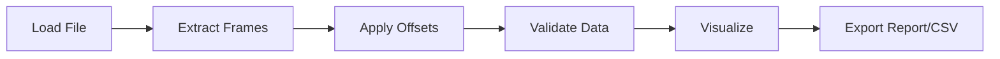

<h1 align="center">⚡ Telemetry Frame Range Investigator ⚡</h1>

  

  
  
  
  
  

---

> 🚫 Modification of this source code is strictly prohibited.

---

## 🧠 Overview

This application is a powerful Python-based GUI tool designed for extracting, analyzing, and validating telemetry frame data from structured documents such as PDF, DOCX, and TXT files. It intelligently parses frame numbers and associated word sequences, applies configurable offsets, and detects irregularities in data ordering.

Built with a visually enhanced Neon Circuit interface using PyQt6, the tool provides an intuitive and efficient environment for engineers to inspect complex telemetry mappings. With support for visualization and structured export, it bridges the gap between raw telemetry logs and actionable engineering insights.

---

## ✨ Features

🚀 **Smart Data Extraction**

* 📂 Load PDF, DOCX, and TXT files
* 🔍 Automatic frame & word parsing

⚙️ **Data Processing**

* 🔧 Adjustable frame and word offsets
* ⚠️ Irregular sequence detection

📊 **Visualization**

* 📊 Interactive frame visualizer
* 📈 Frame distribution chart

📁 **Export & Reporting**

* 🧾 Generate detailed reports
* 📤 Export structured CSV files

---

## ⚙️ Requirements

### 💻 Software

* Visual Studio Code
* Python 3.13.12

### 📦 Libraries

* PyQt6
* PyMuPDF (fitz)
* python-docx

  

---

## ⚙️ How It Works

---

## 🎯 Use Case

This tool is ideal for telemetry engineers and developers who need to validate frame-word mappings, detect missing or inconsistent values, and generate structured datasets for further processing. It is particularly useful in environments where data integrity and precise mapping are critical, such as aerospace, defense, and embedded systems.

---

## 👨‍💻 Author

  <b>Chiranjib Kar</b> 
  Co-Developer: Biswajit Das  

---

  

## 📜 License & Usage

This project is licensed under a **Custom Source-Available License**.

### ✅ You are allowed to:
- Use the software for personal or commercial purposes
- Run and distribute the software in its original form

### ❌ You are NOT allowed to:
- Modify, alter, or create derivative works from the source code
- Redistribute modified versions of this software
- Rebrand or sell this software as your own

### ⚠️ Note:
This is **not an open-source license**. The source code is provided for transparency and usage, but not for modification.

For full terms, see the [LICENSE](./License) file.
